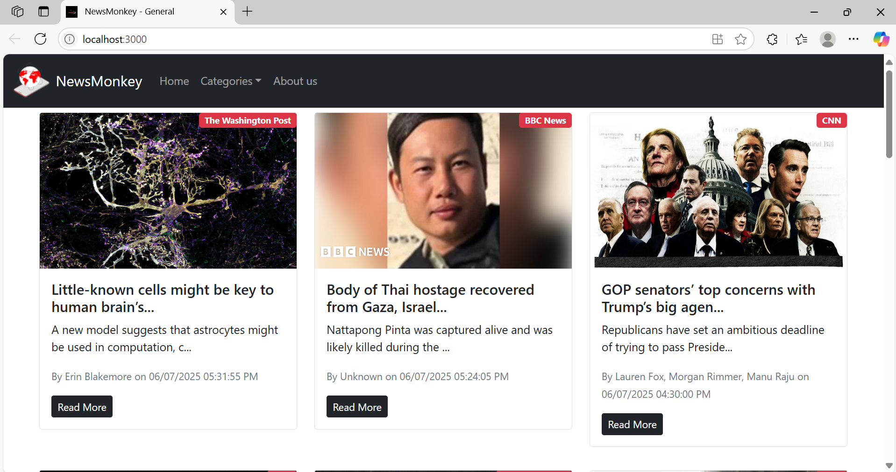
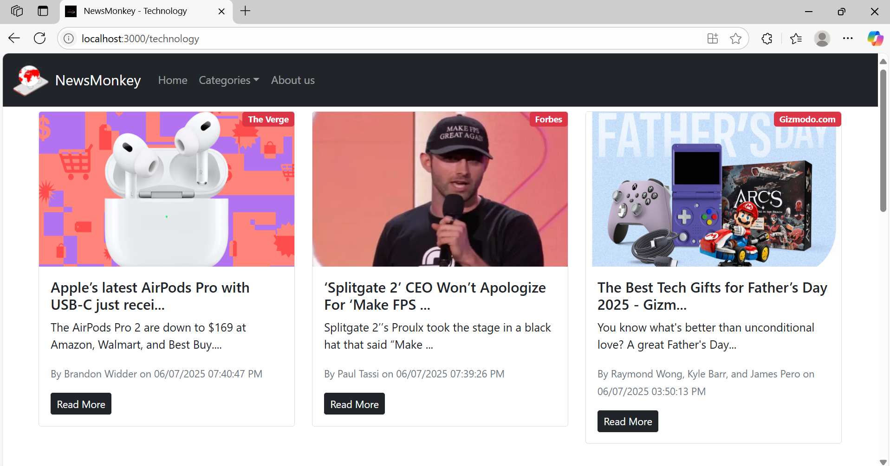

# 📰 NewsMonkey – React News App

**NewsMonkey** is a responsive and dynamic news application built using **React Class Components**. It leverages the [NewsAPI](https://newsapi.org) to fetch and display real-time news articles across various categories such as business, entertainment, health, science, sports, and technology.

---

## 🚀 Features

- 🔄 Infinite scroll to continuously load news
- 🌐 Category-wise news browsing
- 📄 Responsive UI using Bootstrap 5
- 🔍 Dynamic props for country, page size, and category
- 🌀 Loading spinner while fetching data
- 📰 Clean card layout with title, description, image, and source

---

## 🔧 Tech Stack

- React (Class Components)
- JavaScript (ES6+)
- Bootstrap 5
- NewsAPI

---

## 📦 Installation

1. Clone the repository:
   ```bash
   git clone https://github.com/ShreyaaPawar/newsmonkey.git
   ```

2. Navigate to the project directory:
   ```bash
   cd newsmonkey
   ```

3. Install dependencies:
   ```bash
   npm install
   ```

4. Add your NewsAPI key in `.env`:
   ```
   REACT_APP_NEWS_API_KEY=your_api_key_here
   ```

---

## ▶️ Running the App

```bash
npm start
```

Open [http://localhost:3000](http://localhost:3000) to view it in your browser.

---

## 📸 Screenshot Preview

### Home Page:


### Business News:


---

## 📁 Folder Structure

```
newsmonkey/
├── public/
├── src/
│   ├── components/
│   │   ├── News.js
│   │   ├── NewsItem.js
│   │   └── Spinner.js
│   ├── App.js
│   ├── index.js
│   └── ...
├── .env
├── package.json
└── README.md
```
